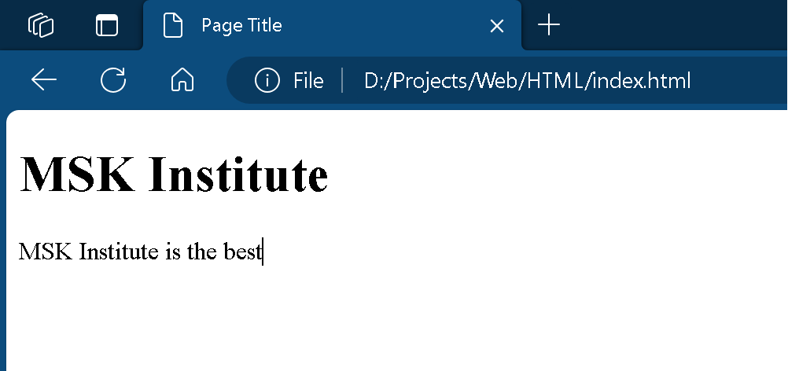

># HTML Introduction

>## What is HTML?
>-  HTML stands for `Hyper Text Markup Language`
>-  HTML is the standard markup language for `creating Web pages`
>-  HTML describes the structure of a Web page
>-  HTML consists of a series of elements
>-  HTML elements tell the browser how to display the content
>-  HTML elements label pieces of content such as "this is a heading", "this is a paragraph", "this is a link", etc.

>### [Example](index.html)
>```html
><!DOCTYPE html>
><html>
>   <head>
>       <title>Page Title</title>
>   </head>
>   <body>
>      <h1>MSK Institute</h1>
>      <p>MSK Institute is the best</p>
>   </body>
></html>
>```
>### Explained
>- `<!DOCTYPE html>` declaration defines that this document is an HTML5 document
>- `<html>` element is the root element of an HTML page
>- `<head>` element contains meta information about the HTML page
>- `<title>` element specifies a title for the HTML page (which is shown in the browser's title bar or in the page's tab)
>- `<body>` element defines the document's body, and is a container for all the visible contents, such as headings, paragraphs, images, hyperlinks, tables, lists, etc.
>- `<h1>` element defines a large heading
>- `<p>` element defines a paragraph

<br>

>## Web Browsers
The purpose of a web browser (Chrome, Edge, Firefox, Safari) is to read HTML documents and display them correctly.
A browser does not display the HTML tags, but uses them to determine how to display the document:
 


## HTML Page Structure

Below is a visualization of an HTML page structure:
```html
<!DOCTYPE html>
<html>
<head>
    <title>Page Title</title>
</head>
<body>
    <h1>MSK Institute</h1>
    <p>MSK Institute is the best for learn Computer Courses and Coding Classes.</p>
</body>
</html>
```

> **Note:** The content inside the `<body>` section (the white area above) will be displayed in a browser The content inside the `<title>` element will be shown in the browser's title bar or in the page's tab.

## HTML History
Since the early days of the World Wide Web, there have been many versions of HTML:

| Year | Version |
| ------ | ------ |
| 1989 | Tim Berners-Lee invented www |
| 1991 | Tim Berners-Lee invented HTML |
| 1993 | Dave Raggett drafted HTML+ |
| 1995 | HTML Working Group defined HTML 2.0 |
| 1997 | HTML 3.2 |
| 1999 | HTML 4.01 |
| 2000 | XHTML 1.0 |
| 2008 | HTML5 First Public Draft |
| 2012 | HTML5 Living Standard |
| 2014 | HTML5 |
| 2016 | HTML 5.1 |
| 2017 | HTML5.1 2nd Edition |
| 2017 | HTML5.2 |


# [Next>>>](../02_SetUp/SetUp.md)