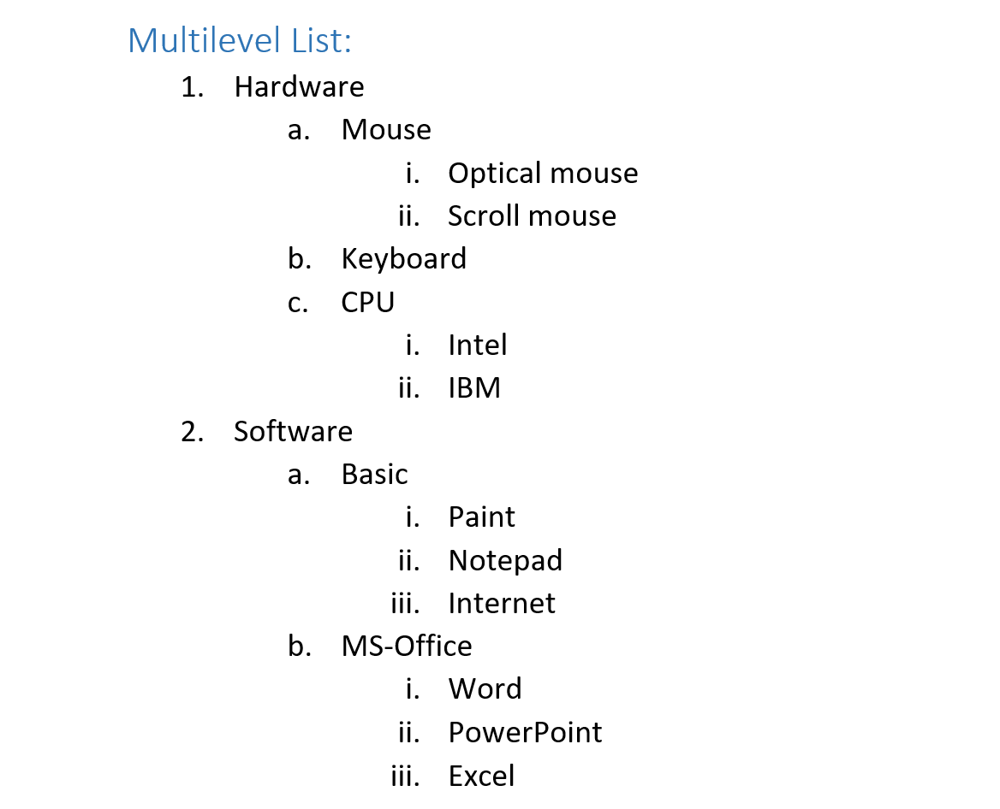

# HTML Lists
HTML lists allow web developers to group a set of related items in lists.

<h4>An Ordered HTML List</h4>
<ol>
  <li>Sumit</li>
  <li>Amit</li>
  <li>Aryan</li>
</ol>

<h4>An Unordered HTML List</h4>
<ul>
  <li>Sumit</li>
  <li>Amit</li>
  <li>Aryan</li>
</ul>  

## Ordered ([more](03_Ordered_Lists.md))
An ordered list starts with the `<ol>` tag. Each list item starts with the `<li>` tag.

The list items will be marked with numbers by default:

```html
<ol>
  <li>Sumit</li>
  <li>Amit</li>
  <li>Aryan</li>
</ol>
```


## Unordered ([more](02_Unordered_List.md))

An unordered list starts with the `<ul>` tag. Each `list item` starts with the `<li>` tag.

The list items will be marked with bullets (small black circles) by default:

```html
<ul>
  <li>Sumit</li>
  <li>Amit</li>
  <li>Aryan</li>
</ul>
```




## HTML Description Lists

A description list is a list of terms, with a description of each term.

<dl>
  <dt>Sumit</dt>
  <dd>- He is a python developer.</dd>
  <dt>Aryan</dt>
  <dd>- He is student of 3rd class.</dd>
</dl>

The `<dl>` tag defines the description list, the `<dt>` tag defines the term (name), and the `<dd>` tag describes each term:

```html
<dl>
  <dt>Sumit</dt>
  <dd>- He is a python developer.</dd>
  <dt>Aryan</dt>
  <dd>- He is student of MSK Institute.</dd>
</dl>
```


# [<<<Back](../11_Links/Links.md) : [Next>>>](../13_Tables/01_Table.md)
