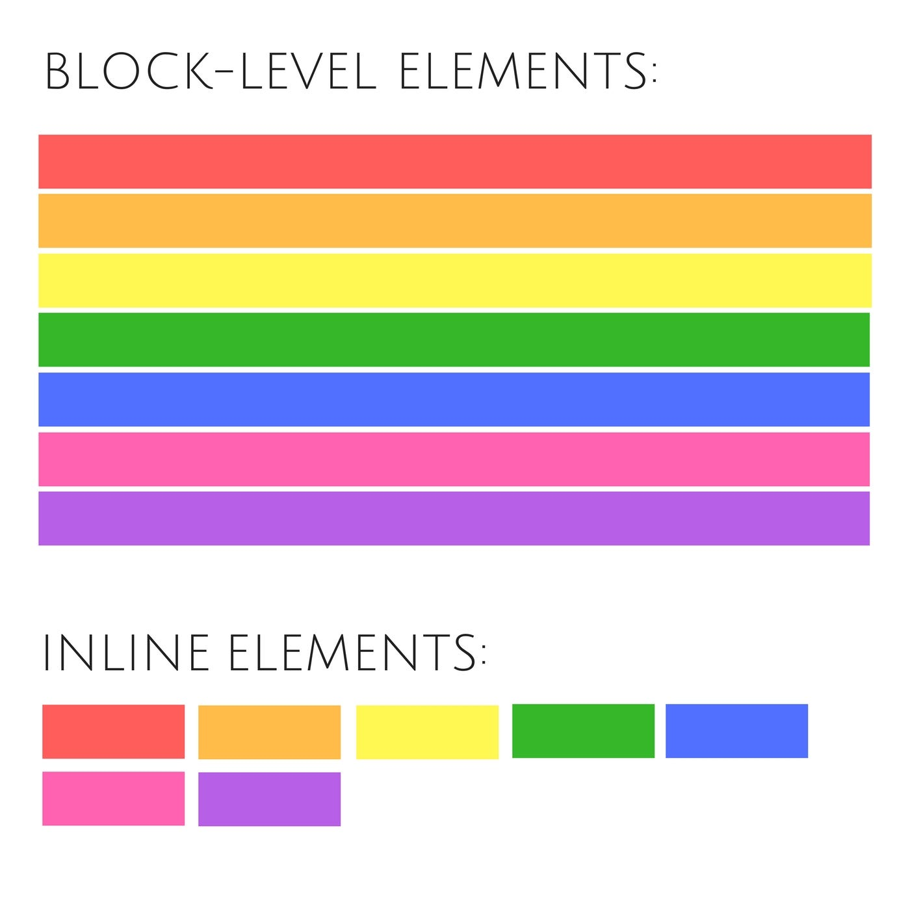

# HTML Block Elements
You already know about HTML inline elements. All HTML tags have specific display behavior: they are either block-level elements or inline elements.

### What are Block-level Elements?
Block-level elements are those that start on a new line and take up the entire width of their container by default. They essentially claim all the horizontal space for themselves, pushing any content that comes after them to a new line.

### Characteristics of Block-level Elements:
Always start on a new line.

Take up the full width available.

Width and height can be controlled via CSS.

Can contain other block-level as well as inline elements.

### Common Block-level Elements: [Example](block_elements.html)

- `<h1>,<h2>,<h3>,<h4>,<h5>,<h6>` - Headings
- `
` - Paragraphs
- `
` - Horizontal rule
- `<address>` - Address information
- `<article>` - Article content
- `<aside>` - Sidebar content
- `<blockquote>` - Block quotations
- `<canvas>` - Drawing area
- `<dd>` - Description in a description list
- `
` - Generic container
- `<dl>` - Description list
- `<dt>` - Term in a description list
- `<fieldset>` - Group of related form elements
- `<figcaption>` - Caption for a figure
- `<figure>` - Image or media with a caption
- `<footer>` - Footer of a section or page
- `<form>` - HTML form
- `<header>` - Header of a section or page
- `<li>` - List item
- `<main>` - Main content of a document
- `<nav>` - Navigation links
- `<noscript>` - Alternate content when JavaScript is not enabled
- `<ol>` - Ordered list
- `<ul>` - Unordered list
- `<pre>` - Preformatted text
- `<section>` - Standalone section in a document
- `<table>` - Table
- `<video>` - Video content

# HTML Inline Elements
Inline Elements don't start on a new line. It only takes the width required to cover the content.

HTML elements are generally divided into two categories: Block-level and Inline elements.

## Styling Inline Elements
You can use CSS to style inline elements. However, some properties like width and height may not apply.

## list of Inline Elements : [Example](inline_elements.html)
- `<a>`
- `<abbr>`
- `<acronym>`
- `<button>`
- ` `
- `<big>`
- `<bdo>`
- `<b>`
- `<cite>`
- `<code>`
- `<dfn>`
- `<i>`
- `<em>`
- ``
- `<input>`
- `<kbd>`
- `<label>`
- `<map>`
- `<object>`
- `<output>`
- `<tt>`
- `<time>`
- `<samp>`
- `<script>`
- `<select>`
- `<small>`
- ``
- `<strong>`
- ``
- ``
- `<textarea>`
