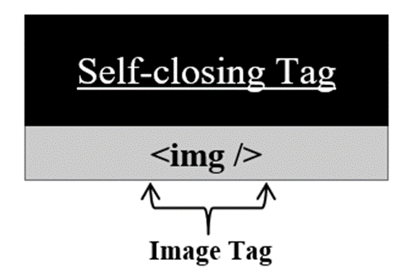

# HTML Images
To represent HTML pages beautifully and to explain content, we use images for that. Our ability to comprehend complex things is aided by visual representations to do that we use images.
 

 
`` tag:  "used to add an image to the webpage" 
### Syntax:
```html

```
 
- `` tag is used to insert images on an HTML page.
- `` tag is an empty tag which means it doesn’t have a corresponding closing tag.
- `` tag uses mandatory attributes i.e. "alt attribute" a text description for an image and "src attribute" for the location path of an image. These attributes provide additional information about the image tag.
- Png, jpeg, jpg, and gif are extensions used by images.
 


>There are two ways to specify the URL in the `src` attribute:
>
>**1. Absolute URL** - Links to an external image that is hosted on another website. 
>
>    `src="https://github.com/mskinstitute/html/blob/main/assets/img/hello.png?raw=true"`.
>
>**Notes:** External images might be under copyright. If you do not get permission to use it, you may be in violation of copyright laws. In addition, you cannot control external images; it can suddenly be removed or changed.
>
>**2. Relative URL** - Links to an image that is hosted within the website. Here, the URL does not include the domain name. If the URL begins without a slash, it will be relative to the current page. Example: src="hello.png". If the URL begins with a slash, it will be relative to the domain. 
    `src="/assets/img/hello.png"`.

> **Tip:** It is almost always best to use relative URLs. They will not break if you change domain.


## Setting image mandatory attributes:
- `"src attribute"` -> for the location path of an image.
### For example:
```html

```
> NOTE: If we want to find the location of our image. Right-click on your image -> Go to properties -> Check location in the properties.
 
- `"alt attribute"` -> a text description for an image
### For example:
```html

```
 
## Setting image `width/height` attribute:
`` tag uses the height or width attribute to set the height or width of an image. Values for height or width attribute must be in pixel or percentage and value should be placed in double quotes otherwise we can see an error.
For example:
```html

```
> NOTE: This method was used earlier. The styling is now handled by CSS. We can style our image using CSS properties. We can give height, width, border, alignment, etc. to our images. To learn more about styling check our CSS tutorial.

# [<<<Back](../11_Links/Links.md) : [Next>>>](../13_Favicon/favicon.md)