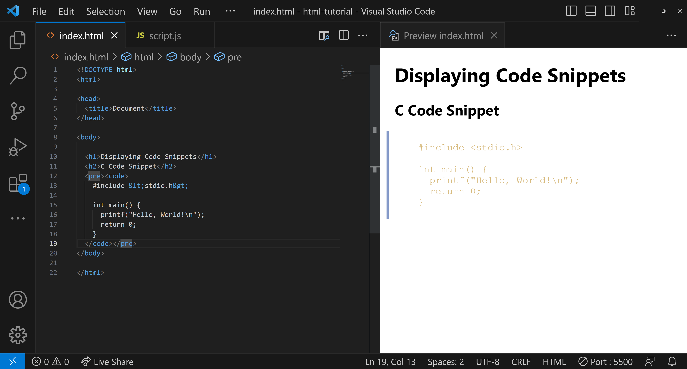
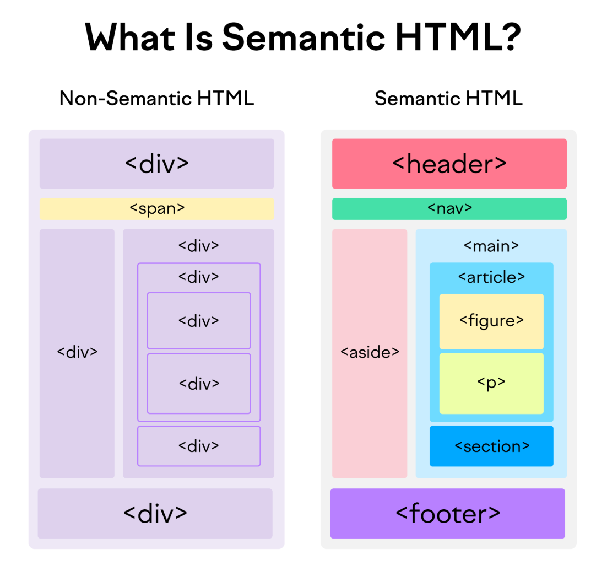

# HTML `Code` Tag

The HTML `<code>` tag is a powerful element for displaying code snippets within a webpage. It preserves both spaces and line breaks, making it ideal for showcasing code. In this blog post, we'll explore how to use the `<code>` tag effectively, especially in conjunction with Prism for code highlighting.

## What is the `<code>` Tag?

The `<code>` tag is a semantic HTML tag that's used for displaying code snippets. It can be used both inline and within a block-level element like `<pre>`.

## Why Use the `<code>` Tag?

-   **Semantic Meaning**: Provides semantic value to the enclosed code.
-   **Readability**: This makes it easier for both browsers and developers to understand that the text is code.
-   **Styling**: Easier to style and highlight with CSS or JavaScript libraries like Prism.

## Basic Usage

The most straightforward way to use the `<code>` tag is inline for short code snippets:

```html
<code>Your code here</code>
```



## Using `<code>` with `<pre>`

For multiline code snippets, it's common to combine the `<code>` tag with the `<pre>` tag:

```html
<pre><code>Your multiline code here</code></pre>
```

## Conclusion

The HTML `<code>` tag is a simple yet powerful way to include code snippets in your webpage.

<br><br>

# HTML `Semantic` Tags

HTML5 introduced a range of semantic tags that provide meaning to the structure of web content. This blog will guide you through the importance and usage of these tags.

## What are Semantic Tags?

Semantic tags add meaning to your HTML. They tell both the browser and the developer what kind of content is being presented.

Here are some of the key semantic tags you must know about:

1.  `<header>`: Used to represent the top section of a web page, often containing headings, logos, and navigation.
    
2.  `<nav>`: Signifies a navigation menu on a web page.
    
3.  `<article>`: Indicates a self-contained piece of content, such as a blog post or news article.
    
4.  `<section>`: Represents a thematic grouping of content on a web page.
    
5.  `<aside>`: Typically used for sidebars or content that is tangentially related to the main content.
    
6.  `<footer>`: Represents the footer of a web page, usually containing copyright information and contact details.
    
7.  `<figure>` and `<figcaption>`: Used for embedding images, diagrams, or charts, along with a caption.
    
8.  `<main>`: Signifies the main content area of a web page.
    
9.  `<time>`: Used to represent time-related information, like dates and times.
    

## 

## Why Use Semantic Tags?

They enhance SEO, improve accessibility, and make your code easier to read and maintain.

## Commonly Used Semantic Tags

Here are some commonly used semantic tags in HTML:

-   **header**: Contains introductory content.
-   **footer**: Holds footer information.
-   **article**: Encapsulates a self-contained composition.
-   **section**: Represents a standalone section.
-   **aside**: Contains content aside from the content it is placed in.
-   **nav**: Holds navigation links.

## Examples

### Using the `<header>` tags and `<footer>` tags

```html
<header>
    <h1>My Website</h1>
    <nav>
        <ul>
            <li><a href="#">Home</a></li>
            <li><a href="#">About</a></li>
            <li><a href="#">Services</a></li>
            <li><a href="#">Contact</a></li>
        </ul>
    </nav>
</header>

<footer>
    <p>Copyright 2023</p>
</footer>
```

### Using the `<article>` and `<section>` tags

```html
<article>
    <h2>Article Title</h2>
    <section>
      <p>Content here</p>
    </section>
</article>

```

### Using the `<aside>` and `<nav>` tags

```html
<aside>
    <p>This is an aside content</p>
</aside>
<nav>
    <ul>
      <li>Home</li>
      <li>About</li>
    </ul>
</nav>
```

### Using the `<figure>` and `<figcaption>` tags

```html
<figure>
    
    <figcaption>This is an example image.</figcaption>
</figure>
```

## Conclusion

Using HTML's semantic tags can greatly benefit both your website's SEO and the maintainability of your code. They offer a way to structure your HTML in a meaningful manner, making your website more accessible and easier to understand.

<br><br>

# HTML `Canvas`

The `<canvas>` element in HTML is a powerful feature for rendering graphics and shapes directly within web pages. Though it's often paired with JavaScript for dynamic rendering, the canvas itself is an HTML element. In this blog, we'll explore what you can do with the `<canvas>` element alone.

## What is Canvas?

The `<canvas>` element serves as a container for graphics, which can be rendered via scripting. Essentially, it offers a drawing area for visual content.

## Why Use Canvas?

Here are some reasons why you might use the `<canvas>` element:

-   **Graphics:** For drawing shapes, graphs, and other visual representations.
-   **Dynamic Content:** To dynamically update visual elements.
-   **Interactivity:** Though this involves JavaScript, the canvas element is the foundation for interactive graphical content.

## Basic Syntax

Here's how you can define a simple `<canvas>` element:

```html
<canvas id="myCanvas" width="200" height="100"></canvas>
```

## `Attributes` of Canvas

While the `<canvas>` element is simple, it does have a couple of important attributes:

-   **width:** Specifies the width of the canvas.
-   **height:** Specifies the height of the canvas.

## Styling with CSS

You can also style the `<canvas>` element with CSS. For example, to add a border:

```css
canvas {
    border: 1px solid black;
}
```

## Conclusion

The HTML `<canvas>` element serves as a robust foundation for creating graphics and other visual elements on a web page. Even without involving JavaScript, understanding the canvas element and its basic attributes can be quite useful.

<br><br>

# HTML `Entities`

HTML entities are a crucial part of HTML markup language. They enable you to display characters that are reserved in HTML or that aren't readily available on the keyboard. In this blog, we'll explore what HTML entities are, their types, and how to use them.

## What Are HTML Entities?

HTML entities are used to represent special characters in a format that the browser can understand. They start with an ampersand (&) and end with a semicolon (;).

## Why Use HTML Entities?

Here are some reasons:

-   **Reserved Characters**: Characters like <, >, and & are reserved in HTML.
-   **Special Symbols**: For symbols like ©, ®, or mathematical symbols.
-   **Non-Breaking Spaces**: To create white spaces that won't break into a new line.

## Common HTML [Entities](https://www.freeformatter.com/html-entities.html)

```html
&lt;  for <
&gt;  for >
&amp; for &
&nbsp; for a non-breaking space
&copy; for ©
```

## How to Use HTML Entities

Entities can be implemented easily within HTML code. Here are some examples:

### Using Reserved Characters

```html
<p>The price is 10 &lt; 20.</p>
```

### Displaying Special Symbols

```html
<p>Copyright &copy; 2023.</p>
```

### Creating Non-Breaking Spaces

```html
<p>This is an example&nbsp;text.</p>
```

## Conclusion

HTML entities are essential for rendering special or reserved characters on a web page. Understanding how to use them effectively is key to creating web pages that display content as intended.
